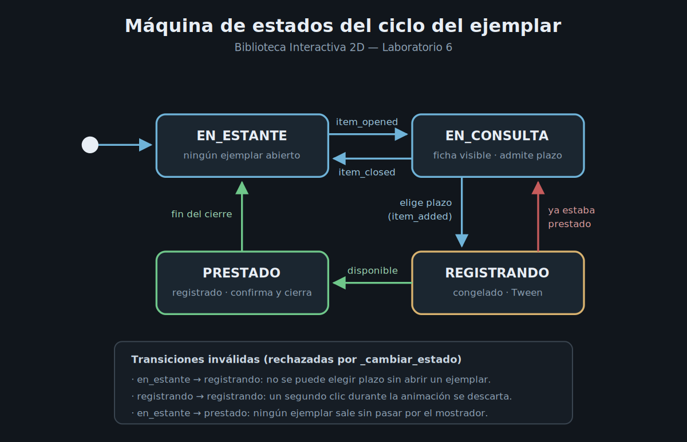

# Registros de Decisión Arquitectónica (ADR)

Índice de las decisiones técnicas del proyecto **Biblioteca Interactiva 2D**.
Los registros anteriores se conservan íntegros; cada laboratorio agrega uno nuevo.

| ADR | Decisión | Laboratorio | Documento |
| --- | --- | --- | --- |
| 001 | Navegación desacoplada mediante un Event Bus global | Lab 2 | [doc/adr/0001-uso-de-event-bus.md](doc/adr/0001-uso-de-event-bus.md) |
| 002 | Estructura modular por dominio y co-localización física | Lab 3 | [doc/adr/ADR-002-estructura-modular-y-colocalizacion.md](doc/adr/ADR-002-estructura-modular-y-colocalizacion.md) |
| 003 | Registro global de préstamos y componente `ButtonNav` | Lab 4 | [doc/adr/ADR-003-global-manager-button-nav.md](doc/adr/ADR-003-global-manager-button-nav.md) |
| 004 | Máquina de estados finita para el ciclo del ejemplar | Lab 6 | En este documento |

---

# ADR-004 — Máquina de estados finita para el ciclo del ejemplar

| Campo | Valor |
| --- | --- |
| **Estado** | Aceptada |
| **Fecha** | 2026-10-01 |
| **Autor** | Jolman Harley Gamboa Salamanca |
| **Contexto** | Producción de Videojuegos 2026-2 — Laboratorio 6 (FSM y animaciones programáticas) |
| **Relacionada con** | ADR-001 (Event Bus), ADR-003 (GlobalManager y ButtonNav) |

## Contexto

La sala de lectura entregada en el Laboratorio 4 funcionaba, pero el recorrido
de un ejemplar —del estante a la consulta, de la consulta al préstamo— no
existía como concepto en el código. Era el resultado implícito de una variable
de presentación (`_libro_seleccionado`) dentro de la pantalla. Eso dejaba tres
problemas comprobables:

1. **Préstamos duplicados.** Pulsar un plazo dos veces registraba el mismo
   ejemplar otra vez, sobrescribiendo su plazo anterior sin que el lector lo
   notara. Nada distinguía "sacar un libro" de "cambiarle el plazo".
2. **El estado vivía en la vista.** Al navegar a Préstamos activos y volver, la
   consulta se perdía: `queue_free()` destruía el panel y con él la noción de
   qué ejemplar estaba abierto, aunque el préstamo sí sobreviviera.
3. **No había noción de disponibilidad.** Un ejemplar ya prestado podía volver a
   salir del estante, lo que contradice la regla más básica de una biblioteca.

Los tres son la misma falla: un comportamiento con etapas que nunca se modeló
como tal.

## Decisión

Se modela el ciclo del ejemplar como una **máquina de estados finita alojada en
`GlobalManager`**, que ya era el dueño del registro de préstamos.

**Estados** (`enum EstadoPrestamo`):

| Estado | Significado | Qué permite |
| --- | --- | --- |
| `EN_ESTANTE` | Ningún ejemplar abierto. | Abrir un libro del estante. |
| `EN_CONSULTA` | La ficha está visible y el lector decide. | Elegir plazo, cambiar de libro o devolverlo al estante. |
| `REGISTRANDO` | El mostrador sella el préstamo. | Nada: el estante y las devoluciones quedan congelados. |
| `PRESTADO` | El ejemplar salió de la sala. | Nada; el sistema cierra el ciclo y libera el estante. |

**Transiciones permitidas**, declaradas en una tabla explícita:

```gdscript
const TRANSICIONES: Dictionary = {
    EstadoPrestamo.EN_ESTANTE:  [EstadoPrestamo.EN_CONSULTA],
    EstadoPrestamo.EN_CONSULTA: [EstadoPrestamo.REGISTRANDO, EstadoPrestamo.EN_ESTANTE],
    EstadoPrestamo.REGISTRANDO: [EstadoPrestamo.PRESTADO, EstadoPrestamo.EN_CONSULTA],
    EstadoPrestamo.PRESTADO:    [EstadoPrestamo.EN_ESTANTE]
}
```

**Mecanismo central.** `_cambiar_estado()` es el único punto del sistema que
modifica `_estado_prestamo`. Valida el salto contra la tabla, lo rechaza con una
traza en consola si no está permitido, y solo entonces notifica el cambio por
`EventBus.loan_state_changed`. Devuelve `false` cuando la transición no ocurre,
lo que permite descartar la intención que la provocó sin efectos colaterales.

**Separación entre estado y transición.** El comportamiento propio de cada
estado se expresa como permiso: un plazo solo se acepta en `EN_CONSULTA`, una
devolución solo fuera de `REGISTRANDO`. Las acciones de transición —escribir el
ejemplar en el registro, recalcular los días y limpiar la consulta— ocurren una
sola vez, en el paso `REGISTRANDO → PRESTADO`, y no se repiten mientras el
sistema permanece en un estado.

**El ejemplar en consulta pasó a ser estado global.** `estado["ejemplar_en_consulta"]`
vive junto al registro de préstamos, por lo que sobrevive al `queue_free()` de
los paneles, igual que todo lo demás desde el ADR-003.

**Vocabulario compartido.** El bus declara los nombres de estado como constantes
(`ESTADO_REGISTRANDO`, etc.) y transporta cadenas, no el `enum`. Así las
pantallas reaccionan al estado sin depender de la representación interna del
gestor, que es la misma regla de desacoplamiento del ADR-001.

**Animación ligada al estado.** `REGISTRANDO` tiene duración real
(`DURACION_REGISTRO`), que es la ventana en la que la interfaz anima con
`Tween`: la ficha se encoge y se atenúa, como si el ejemplar pasara al
mostrador, y el veredicto aparece con un destello verde o rojo. La animación
comunica en qué etapa está el ciclo; no es decorativa.

## Alternativas consideradas

| Alternativa | Motivo del rechazo |
| --- | --- |
| Mantener `_libro_seleccionado` y agregar banderas (`_registrando`, `_bloqueado`) | Es el punto de partida. Con cuatro etapas, las combinaciones posibles crecen más rápido que las válidas, y nada impide un estado imposible. |
| Alojar la FSM en la sala de lectura | El ciclo debe sobrevivir al `queue_free()` de la pantalla; si viviera en la vista, navegar a Préstamos activos durante un registro perdería el estado. |
| Un nodo `LoanStateMachine` aparte, hijo de `MainApp` | Más ortodoxo, pero obligaría a duplicar o exponer el registro de préstamos, que ya vive en `GlobalManager`. Se prefirió no partir la fuente de verdad. |
| `AnimationPlayer` en lugar de `Tween` | Exige recursos de animación por escena para un efecto de medio segundo; `Tween` se crea en código y se ajusta con la constante de duración del estado. |
| Esperar a que la interfaz avise que terminó la animación | Pondría el ritmo de la regla de negocio en manos de la vista. Se invirtió: el estado define cuánto dura y la vista anima dentro de esa ventana. |

## Consecuencias

**Ventajas**

- Los estados imposibles dejaron de ser alcanzables: la tabla es la
  especificación y el código no puede contradecirla.
- Un ejemplar prestado ya no puede volver a salir del estante sin devolverse; la
  regla quedó en un solo lugar.
- Agregar una etapa (una reserva, una multa por vencimiento) es añadir una
  entrada al `enum` y sus transiciones; no hay que revisar banderas dispersas.
- Cada rechazo queda registrado en consola, lo que hace auditable el
  comportamiento durante la sustentación.
- El lector percibe el ciclo: ve la ficha salir hacia el mostrador y recibe el
  veredicto con color.

**Costos**

- Las pantallas dependen de dos eventos más (`loan_state_changed`, `loan_result`)
  y deben representar cuatro estados en vez de reaccionar a un único resultado.
- La duración de `REGISTRANDO` acopla el ritmo de la regla con el de la
  animación. Se mitiga dejando esa duración como una constante del dominio, en
  un solo lugar.
- `_on_item_added()` pasó a ser una corrutina (`await`), por lo que su flujo ya
  no se lee de corrido; se compensó documentando cada transición en el código.

## Justificación

El ciclo del ejemplar es el comportamiento con etapas más claro del proyecto y
el que el usuario ejecuta en cada sesión. Modelarlo con una FSM no agrega una
capa artificial: pone nombre a algo que ya existía de forma implícita y traslada
a una tabla legible las reglas que antes estaban repartidas en condiciones
sueltas dentro de la interfaz.


